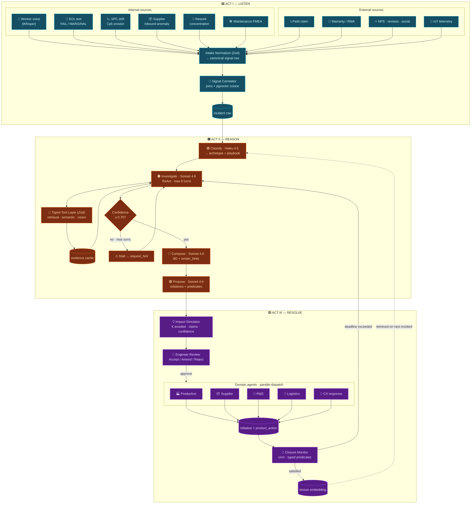
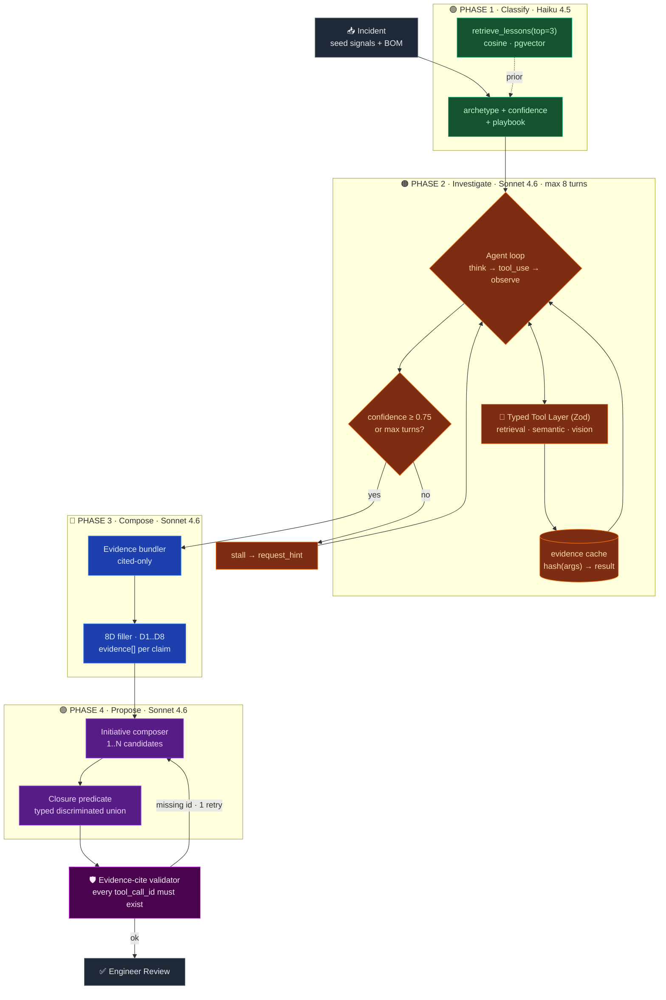

<div align="center">

<br />

# Resolve

### *Every voice becomes an initiative.*

**A closed-loop quality intelligence layer for manufacturing.**
Turns any signal — internal anomaly or external customer voice — into a routed, tracked, measurable initiative.
**8D and FMEA fall out as projections.**

<br />

[](https://github.com/harjotsm/Thinc-Hackathon-2026-Manex)
[](https://nextjs.org)
[](https://www.typescriptlang.org)
[](https://www.anthropic.com)
[](https://github.com/pgvector/pgvector)
[](https://ui.shadcn.com)

[**Architecture**](#-architecture) · [**The moat**](#-the-moat) · [**Quick start**](#-quick-start) · [**Team**](#-team)

<br />


<sub><b>End-to-end walkthrough:</b> a worker reports a defect by voice → the signal lands in the Inbox → an engineer opens the Canvas → clicks <i>Run AI</i> → the agent investigates, proposes a hypothesis tree, and dispatches an initiative.</sub>

</div>

---

## ⚡ Why Resolve?

Manufacturing quality loops are **broken** in the gap between *signal* and *action*.

> A worker hears a weird click. A field tech files a warranty claim in Chinese. SPC drifts 4% over six weeks. Three separate field returns reference the same cap. **Each of these lives in a different system, a different language, a different team's head.** The 8D ends up as a PDF. Lessons never get re-used.

Resolve sits on top of Manex as a **unified intelligence layer** that:

- **Listens** to every signal — voice, EOL, SPC, supplier, field claim, warranty, NPS, IoT
- **Reasons** with a bounded, evidence-grounded agent (no free-form ReAct, no hallucinated claims)
- **Resolves** by dispatching to the right domain agent and watching for measurable closure

Not a chatbot. Not a ticket tracker. A **closed loop.**

---

## 🛡 The moat

Manufacturing root-cause is not a chatbot problem. It is a **bounded reasoning** problem over typed structured data, with adversarial hallucinations, multiple writer systems, and closure that has to be *measurable* — not stampable. Three things make this hard, and three things make ours different.

<table>
<tr>
<td width="33%" valign="top">

### 🧩 Orchestrated 4-phase pipeline

**Not free-form ReAct.**
Classify → Investigate → Compose → Propose. Each phase has a dedicated model, prompt cache tier, and typed output contract.

<sub>Haiku 4.5 for fast classification (with lesson prior). Sonnet 4.6 for the reasoning phases.</sub>

</td>
<td width="33%" valign="top">

### 🔒 Typed Zod tool layer

**No free-form SQL, ever.**
12 read tools, 3 write tools. Write tools are gated — the Investigate loop cannot mutate state.

<sub>Evidence-cite post-validator rejects any output whose claims don't reference a real <code>tool_call_id</code>.</sub>

</td>
<td width="33%" valign="top">

### 🔁 Closure predicates

**Not checkboxes.**
Every dispatched initiative carries a typed JSON predicate. A cron evaluates it against live data.

<sub>Only satisfied predicates reach the lesson embedding. A fix isn't closed because a human said so — it's closed because the metric moved.</sub>

</td>
</tr>
</table>

---

## 🏗 Architecture

### System architecture

End-to-end pipeline. Every box is a typed implementation unit. Incidents are durable between acts; lessons feed back into classification.



### Data + LLM pipeline

The orchestrator — evidence-grounded, cached, bounded. Four phases with dedicated models. Typed Zod tool layer. Evidence-cite post-validator. pgvector lesson retrieval biases classification. Anthropic prompt cache reuses ~90% of tokens across turns.



### What makes the pipeline work

| | |
|---|---|
| 🗜 **Anthropic prompt cache** | Static system-prompt tier (domain vocab, tool specs, playbook). **~90% token reuse**, ~5× cost reduction across turns. |
| 🔒 **Typed Zod tool layer** | 12 read tools, 3 write tools. Write tools gated post-approval. No free-form SQL, ever. **Bounded at 8 turns.** |
| 🧬 **pgvector** | Free-text signatures embedded (`FLOAT8[]`, 1536-dim, cosine). Structured queries stay in SQL. |
| 🎓 **Lessons loop** | Resolved incidents embed their signature; retrieved on Classify to bias the archetype prior. **Cross-plant network effect.** |
| 🛡 **Evidence-cite contract** | Every claim cites a `tool_call_id`. Validator blocks output with orphaned refs — one retry, second failure = hard error. |
| 🎯 **Closure predicates** | Typed JSON, evaluated by cron. A resolution is **not stampable**; it has to measurably close. |

---

## 📖 The four data stories

The seeded dataset contains four explicit root-cause stories — no treasure hunt. Each one exercises a different archetype and a different closure predicate shape.

| # | Story | Archetype | Trace |
|---|---|---|---|
| **1** | **Supplier batch** | `supplier` | ElektroParts / SB-00007 / PM-00008 (100µF caps) |
| **2** | **Calibration drift** | `drift` | VIB_TEST at Montage Linie 1, W49–W2 |
| **3** | **Design thermal drift** | `design` | MC-200 / R33 / PM-00015 (field-only) |
| **4** | **Operator handling** | `operator` | user_042, orders PO-00012 / 18 / 24 |

Demo targets stories **1** and **3**. See [docs/DATA_PATTERNS.md](docs/DATA_PATTERNS.md) for the full reasoning paths.

---

## 🛠 Built with

<table>
<tr>
<td valign="top" width="33%">

**Frontend**
- Next.js 16 (App Router)
- React 19
- TypeScript 5
- Tailwind v4
- shadcn/ui + base-ui
- React Flow, Recharts

</td>
<td valign="top" width="33%">

**AI & reasoning**
- Anthropic SDK — Claude Haiku 4.5 + Sonnet 4.6
- OpenAI SDK — Whisper + embeddings
- Vercel AI SDK — streaming
- Zod — typed tool contracts

</td>
<td valign="top" width="33%">

**Data & infra**
- PostgreSQL + pgvector
- PostgREST via Supabase-JS
- Cron closure monitor
- Manex-native `product_action` writes

</td>
</tr>
</table>

---

## 🚀 Quick start

```bash
# 1. clone + install
git clone https://github.com/harjotsm/Thinc-Hackathon-2026-Manex.git
cd Thinc-Hackathon-2026-Manex/web
pnpm install

# 2. env — copy and fill (see web/.env.example)
#   DATABASE_URL=...          Manex stack from your handout
#   ANTHROPIC_API_KEY=...
#   OPENAI_API_KEY=...        (Whisper + embeddings only)

# 3. dev
pnpm dev                      # http://localhost:3000
```

Full Manex scaffold, schema, and access details live in [docs/SCAFFOLD.md](docs/SCAFFOLD.md).

---

## 📚 Documentation

| | |
|---|---|
| **[planning/ARCHITECTURE.md](planning/ARCHITECTURE.md)** | Canonical architecture — source of truth |
| **[planning/visualizations/architecture.html](planning/visualizations/architecture.html)** | Engineering dashboard (open locally) |
| **[planning/visualizations/problem-flow.html](planning/visualizations/problem-flow.html)** | Problem flow + persona journey |
| **[docs/SCAFFOLD.md](docs/SCAFFOLD.md)** | Manex challenge environment — Postgres schema, seed data, API |
| **[docs/DATA_PATTERNS.md](docs/DATA_PATTERNS.md)** | The four data stories in detail |
| **[CLAUDE.md](CLAUDE.md)** | Context for Claude Code / SDK agents working in this repo |

---

## 👥 Team

| | | |
|---|---|---|
| **Joscha** | LLM architecture · tools · root-cause agent · pitch | `feat/joscha` |
| **Lila** | Frontend · canvas UX · generative-UI components | `feat/lila` |
| **Harsh** | Fullstack · visualizations · tool-layer implementation | `feat/harsh` |
| **Harjot** | Backend · data layer · DevOps · closure monitor | `feat/harjot` |

**Branching:** `feat/*` → `develop` → `main` via PR. `main` is always deployable. Never commit code directly to `main`.

<br />

<div align="center">

Built in 24 hours at **Thinc! × Manex AI Hackathon · April 2026.**

*De.Constructors*

</div>
